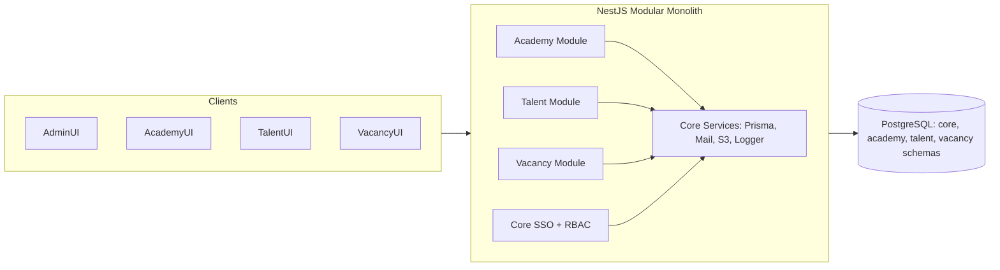
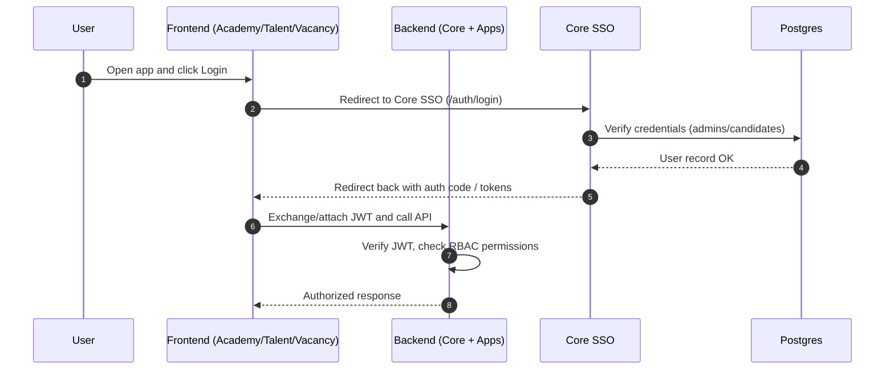
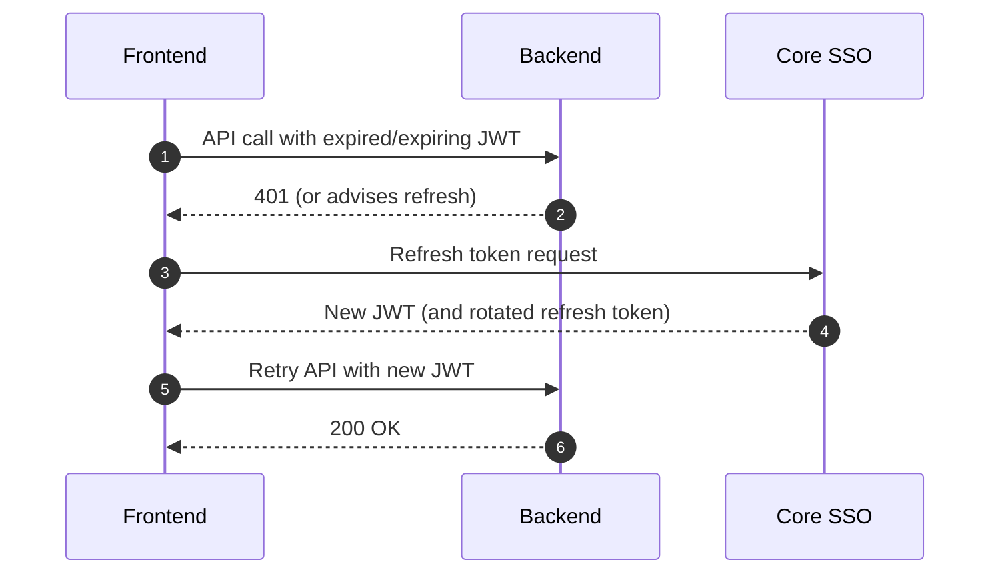
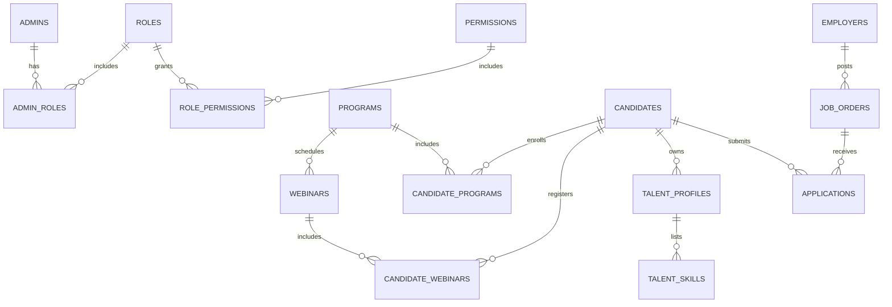

## Platform Overview (Core + Academy + Talent + Vacancy)

This document explains how the platform is organized, how users flow through each app, and the rationale behind architectural choices. It consolidates Core and all app flows into one place for stakeholders and engineers.

### Executive summary (non-technical)

- One login for all apps. Users sign in once (SSO) to Core and can access Academy, Talent, and Vacancy without re‑logging.
- Shared foundation. Security, permissions, storage, email, and database are shared in a single platform to reduce duplication and speed up delivery.
- Clear app boundaries. Each app owns its features and data schema while reusing Core users and permissions.
- Start simple, grow safely. We begin with one backend (modular monolith) to move fast; later we can split services if scale demands it.

### What we are building

- A multi-app platform consisting of:
  - Core: shared identity (SSO), RBAC, shared services (Prisma DB access, storage, mail, logging)
  - Academy: learning programs and webinars
  - Talent: candidate profile management and matching (later)
  - Vacancy: job postings and application flow (later)

- Single PostgreSQL database with multiple schemas for isolation: `core`, `academy`, `talent`, `vacancy`.
- Single modular NestJS backend (modular monolith) exposing app-specific endpoints.

### High-level flow (SSO and app access)

1) A user authenticates via Core SSO
   - The login screen belongs to Core; credentials stored under `core` schema (e.g., `admins`, `candidates`).
   - On success, Core issues JWT (and refresh token) containing app-agnostic subject (user id) and role claims.

2) The user navigates to an app (Academy/Talent/Vacancy)
   - The app frontend presents app-specific UI and calls the same backend.
   - Requests include the Core JWT; the backend validates via shared `JwtModule` and `PermissionsGuard`.
   - Authorization is enforced via Core RBAC: roles → permissions (app-namespaced, e.g., `academy.program.create`).

3) App features access app-specific data
   - Controllers route to services in the respective feature module (Academy/Talent/Vacancy).
   - Services use the shared `PrismaService` to query tables in the app’s schema and, when needed, reference `core` entities.

4) Shared services across all apps
   - Email via `MailerModule`, file/object storage via `S3Module`, logging/interceptors via Core.

### App-specific flows

Academy
- Login: via Core SSO (JWT). Same identity usable across Talent/Vacancy.
- Browse Programs: list/filter `academy.programs`; visibility and soft-delete respected.
- Prerequisite: candidates must attend an eligible webinar before enrolling in a program.
- Enroll: upon prerequisite met, create join row in `academy.candidate_programs` linking `core.candidates` to a program; otherwise return a clear error with next steps.
- Attend Webinar: register in `academy.candidate_webinars`; webinar can be bound to a program or standalone; attendance status must be recorded.
- Admin actions: create/update programs/webinars with permissions like `academy.program.create`, `academy.webinar.update`.

Talent (later)
- Login: via Core SSO.
- Manage Profile: CRUD on talent-specific profile tables; reuses `core.candidates` as identity root.
- Discovery/Matching: app-owned logic referencing shared entities.

Vacancy (later)
- Login: via Core SSO.
- Post/Apply: employers/candidates interact with vacancy tables; RBAC governs who can post, view, apply.

### Architecture choices and rationale

Modular monolith (one NestJS runtime)
- Why: Faster delivery, simpler operations than microservices; clear boundaries via modules; can evolve into services later.
- How: Feature modules per app, Core for cross-cutting concerns; route prefixes (`/academy/*`, etc.) for clarity.

Single DB, multiple schemas
- Why: Stronger logical isolation than a single schema; simplified cross-app queries vs multiple databases.
- How: Prisma `@@schema("...")` to place tables; shared entities in `core`, app entities in their schema.

Centralized SSO (Core)
- Why: One identity across apps enables seamless cross-app access; consolidated RBAC and session handling.
- How: Core issues JWT/refresh; guards enforce access based on namespaced permissions.

RBAC with namespaced permissions
- Why: Avoid collisions as apps multiply; easier role templates per app; better admin UX.
- How: Permissions like `academy.program.create`; transition supports legacy keys where needed.

Cross-cutting concerns
- Logging/Tracing: global interceptors with request context.
- Security: helmet, rate limits (as needed), sanitized responses.
- Mail/Storage: one implementation available to all modules.

### Diagrams

System overview

SSO login flow

Token refresh flow

Core + Academy ERD (summary)

Future entities overview (illustrative)

- Talent
  - `TALENT_PROFILES`: one-to-one with `core.candidates` (extended profile, CV metadata, preferences)
  - `TALENT_SKILLS`: many-to-one with `TALENT_PROFILES` (skill name, level, evidence)
- Vacancy
  - `EMPLOYERS`: hiring organization or employer account (owns job postings)
  - `JOB_ORDERS`: many-to-one with `EMPLOYERS` (title, description, location, salary range, status)
  - `APPLICATIONS`: many-to-one with `JOB_ORDERS` and `core.candidates` (status, submitted_at, screening notes)

### How to extend the platform

Add a new app (e.g., Talent)
- Create a new feature module with controllers/services.
- Add Prisma models with `@@schema("talent")` and migrations.
- Define namespaced permissions `talent.*` and seed them; map roles accordingly.
- Optionally add route prefix `/talent/*`.

Split into services (if needed)
- Introduce an API gateway; split modules into separate services.
- Keep single DB or migrate to per-service DBs with data duplication where justified.

