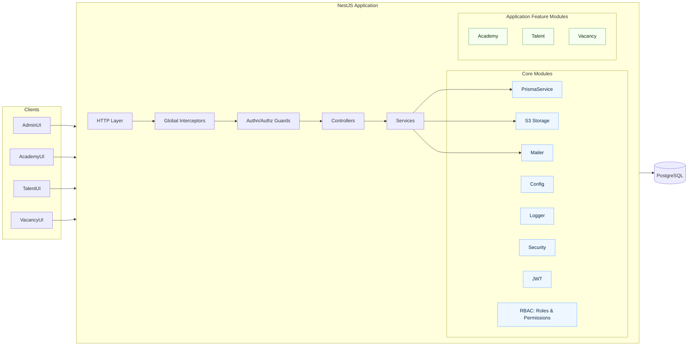
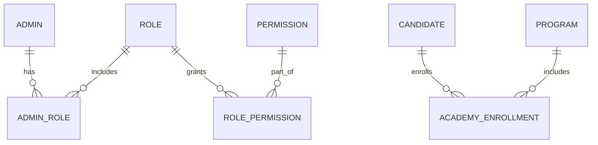

## Platform Architecture (Core + Academy + Talent + Vacancy)

Consolidated high-level architecture and database layout for the multi-app platform.

### Goals

- Single repository with a shared Core serving multiple domain apps
- Single database with isolation via separate DB schemas: `core`, `academy`, `talent`, `vacancy`
- Clear ownership and boundaries; cross-app reuse through the Core
- Consistent auth, logging, and operational concerns across all apps

### Component diagram

### Database layout

- Schemas: `core` owns identity and RBAC; each app owns its domain entities in its schema
- Cross-schema relations allowed (e.g., `academy` referencing `core.candidates`)

