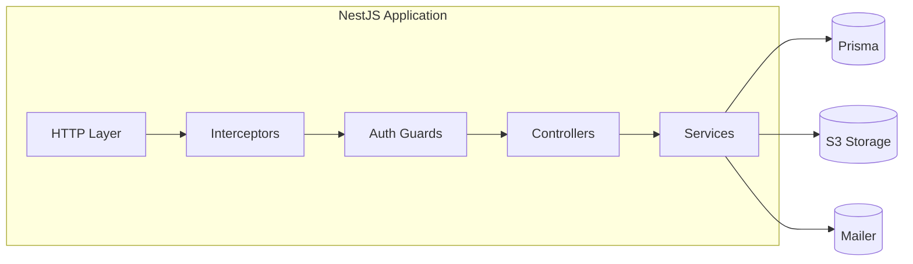
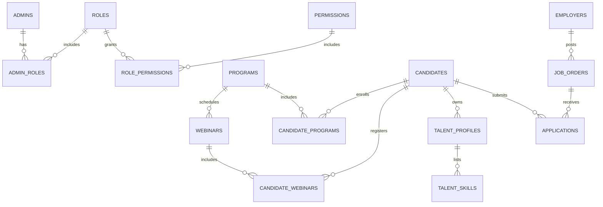

## Architecture and ERD (Core + Academy)

### Runtime architecture

### Core + Academy ERD (from prisma/schema.prisma)

Illustrative future entities

- Talent
  - `TALENT_PROFILES` — 1:1 with `CANDIDATES` storing extended profile attributes
  - `TALENT_SKILLS` — N:1 skills linked to `TALENT_PROFILES`
- Vacancy
  - `EMPLOYERS` — organizations or employer accounts that post jobs
  - `JOB_ORDERS` — jobs created by employers
  - `APPLICATIONS` — candidate applications to job orders, with statuses and timestamps

