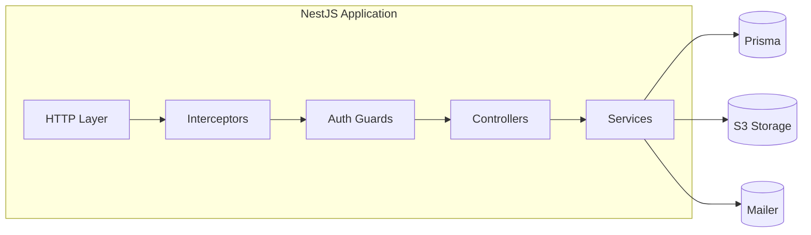
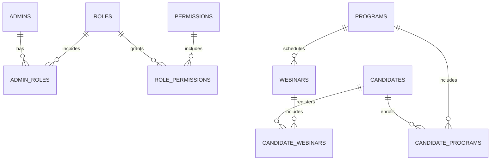

## Architecture and ERD (Core + Academy)

### Runtime architecture

```mermaid
flowchart LR
  subgraph API[NestJS Application]
    direction LR
    G[HTTP Layer]
    I[Interceptors]
    U[Auth Guards]
    CTRL[Controllers]
    SVC[Services]
  end

  G --> I --> U --> CTRL --> SVC
  SVC --> PRISMA[(Prisma)]
  SVC --> S3[(S3 Storage)]
  SVC --> MAIL[(Mailer)]
```

### Core + Academy ERD (from prisma/schema.prisma)

```mermaid
erDiagram
  ADMINS ||--o{ ADMIN_ROLES : has
  ROLES  ||--o{ ADMIN_ROLES : includes
  ROLES  ||--o{ ROLE_PERMISSIONS : grants
  PERMISSIONS ||--o{ ROLE_PERMISSIONS : includes
  PROGRAMS ||--o{ WEBINARS : schedules
  CANDIDATES ||--o{ CANDIDATE_PROGRAMS : enrolls
  PROGRAMS   ||--o{ CANDIDATE_PROGRAMS : includes
  CANDIDATES ||--o{ CANDIDATE_WEBINARS : registers
  WEBINARS   ||--o{ CANDIDATE_WEBINARS : includes
  %% Business rule: enrollment requires prior webinar attendance
```

