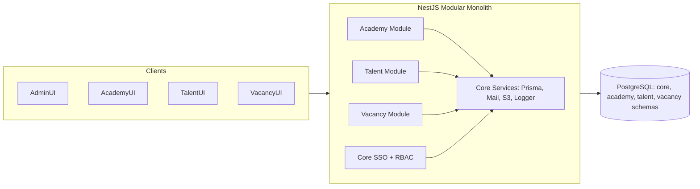
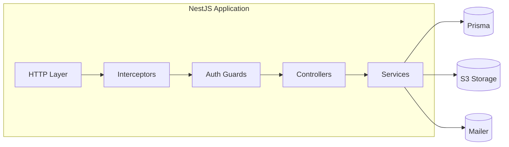
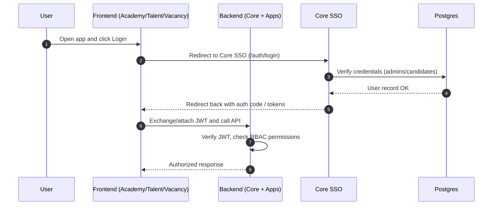
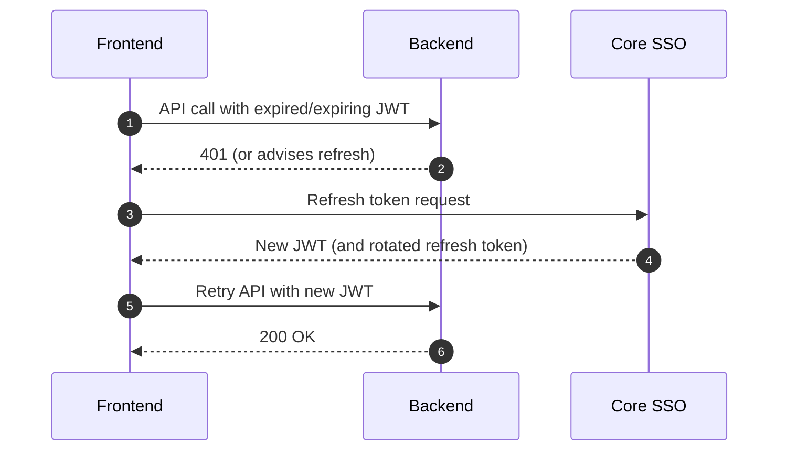
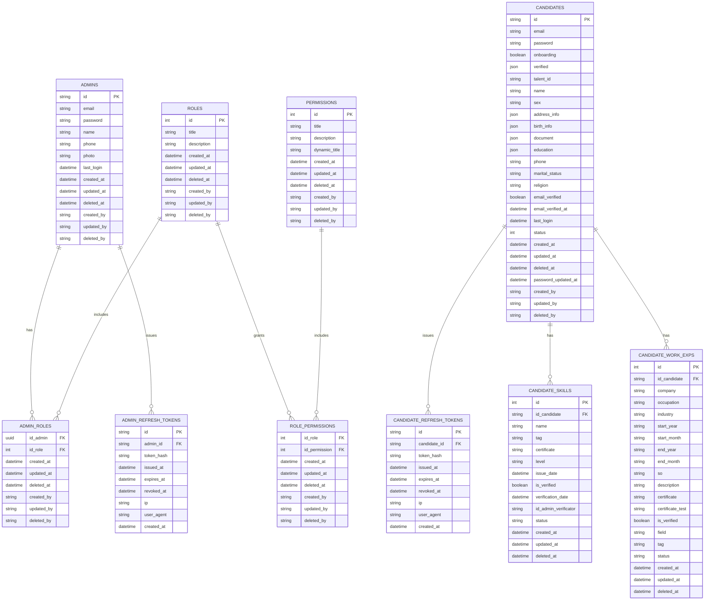
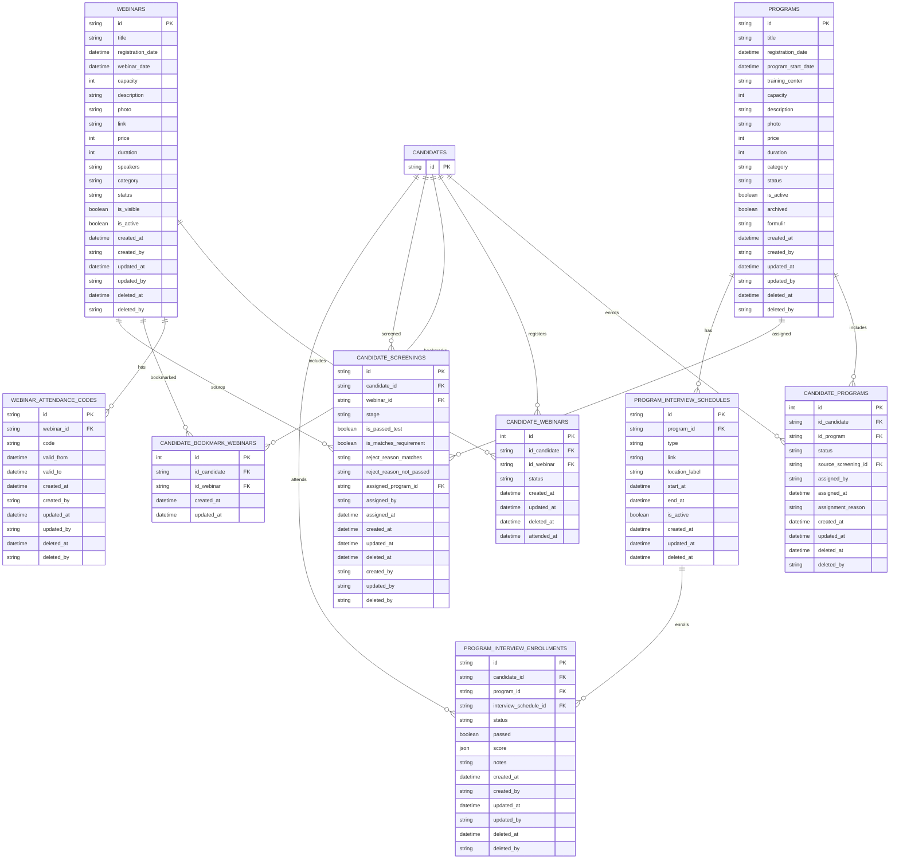
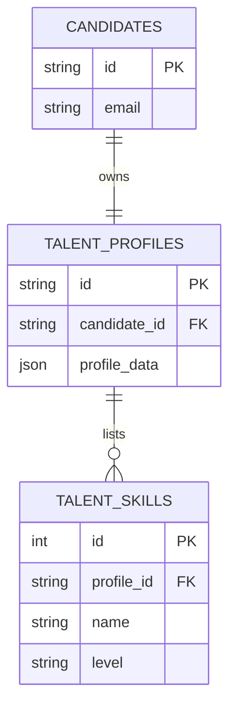
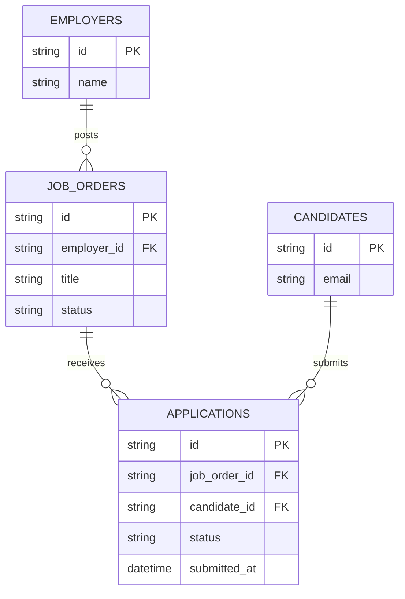

## Diagrams (Mermaid Only)

This document aggregates diagrams only. It includes architecture flowcharts, sequences, and detailed ERDs with table columns.

### System Overview

### Runtime Architecture

### SSO Login Flow

### Token Refresh Flow

### ERD (Core) — Expanded with Columns

### ERD (Academy) — Expanded with Columns

### ERD (Talent) — Placeholder

### ERD (Vacancy) — Placeholder

