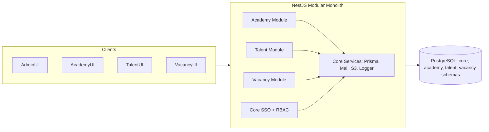
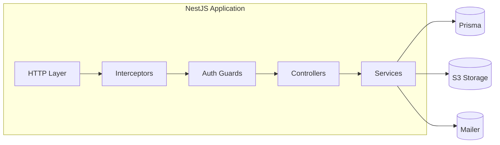
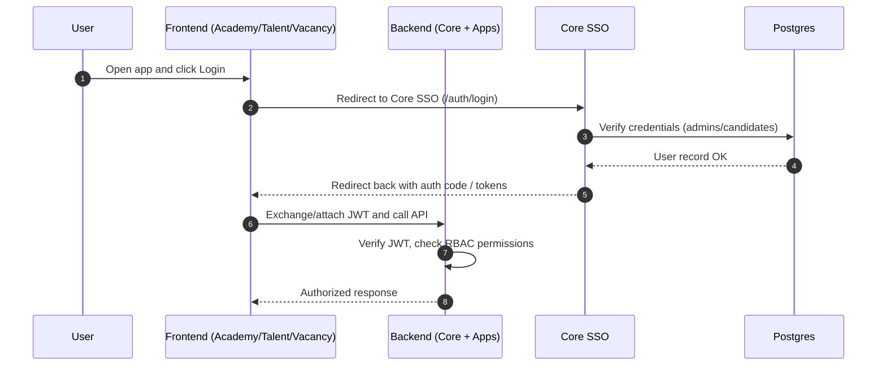
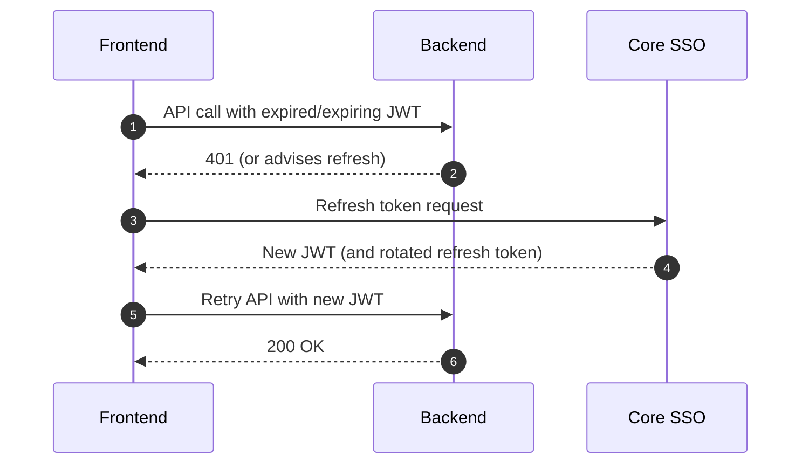

## Diagrams (Mermaid Only)

This document aggregates diagrams only. It includes architecture flowcharts, sequences, and detailed ERDs with table columns.

### System Overview



### Runtime Architecture



### SSO Login Flow



### Token Refresh Flow



### ERD (Core) — Expanded with Columns

```mermaid
erDiagram
  ADMINS {
    uuid id PK
    varchar(225) email UNIQUE
    varchar(225) password
    varchar(225) name
    varchar(225) phone
    varchar(225) photo
    timestamptz last_login
    timestamptz created_at
    timestamptz updated_at
    timestamptz deleted_at
    varchar(50) created_by
    varchar(50) updated_by
    varchar(50) deleted_by
  }
  ADMIN_REFRESH_TOKENS {
    uuid id PK
    uuid admin_id FK->ADMINS.id
    varchar(255) token_hash
    timestamptz issued_at
    timestamptz expires_at
    timestamptz revoked_at
    varchar(100) ip
    varchar(255) user_agent
    timestamptz created_at
  }
  ROLES {
    bigserial id PK
    varchar title UNIQUE
    varchar description
    timestamptz created_at
    timestamptz updated_at
    timestamptz deleted_at
    varchar(50) created_by
    varchar(50) updated_by
    varchar(50) deleted_by
  }
  PERMISSIONS {
    bigserial id PK
    varchar title UNIQUE
    varchar description
    varchar dynamic_title
    timestamptz created_at
    timestamptz updated_at
    timestamptz deleted_at
    varchar(50) created_by
    varchar(50) updated_by
    varchar(50) deleted_by
  }
  ROLE_PERMISSIONS {
    bigint id_role FK->ROLES.id
    bigint id_permission FK->PERMISSIONS.id
    timestamptz created_at
    timestamptz updated_at
    timestamptz deleted_at
    varchar(50) created_by
    varchar(50) updated_by
    varchar(50) deleted_by
  }
  ADMIN_ROLES {
    uuid id_admin FK->ADMINS.id
    bigint id_role FK->ROLES.id
    timestamptz created_at
    timestamptz updated_at
    timestamptz deleted_at
    varchar(50) created_by
    varchar(50) updated_by
    varchar(50) deleted_by
  }
  CANDIDATES {
    uuid id PK
    varchar(225) email UNIQUE
    varchar(225) password
    boolean onboarding
    jsonb verified
    varchar(100) talent_id
    varchar(225) name
    varchar(10) sex
    jsonb address_info
    jsonb birth_info
    jsonb document
    jsonb education
    varchar(50) phone
    varchar(225) marital_status
    varchar(225) religion
    boolean email_verified
    timestamptz email_verified_at
    timestamptz last_login
    int status
    timestamptz created_at
    timestamptz updated_at
    timestamptz deleted_at
    timestamptz password_updated_at
    varchar(50) created_by
    varchar(50) updated_by
    varchar(50) deleted_by
  }
  CANDIDATE_REFRESH_TOKENS {
    uuid id PK
    uuid candidate_id FK->CANDIDATES.id
    varchar(255) token_hash
    timestamptz issued_at
    timestamptz expires_at
    timestamptz revoked_at
    varchar(100) ip
    varchar(255) user_agent
    timestamptz created_at
  }
  CANDIDATE_SKILLS {
    bigserial id PK
    uuid id_candidate FK->CANDIDATES.id
    varchar(225) name
    varchar(50) tag
    varchar certificate
    varchar(100) level
    timestamptz issue_date
    boolean is_verified
    timestamptz verification_date
    varchar(50) id_admin_verificator
    varchar(5) status
    timestamptz created_at
    timestamptz updated_at
    timestamptz deleted_at
  }
  CANDIDATE_WORK_EXPS {
    bigserial id PK
    uuid id_candidate FK->CANDIDATES.id
    varchar(255) company
    uuid occupation FK->OCCUPATIONS.id
    uuid industry FK->INDUSTRIES.id
    varchar(50) start_year
    varchar(50) start_month
    varchar(50) end_year
    varchar(50) end_month
    varchar so
    varchar description
    varchar certificate
    varchar certificate_test
    boolean is_verified
    varchar field
    varchar(50) tag
    varchar(5) status
    timestamptz created_at
    timestamptz updated_at
    timestamptz deleted_at
  }

  ADMINS ||--o{ ADMIN_ROLES : has
  ROLES  ||--o{ ADMIN_ROLES : includes
  ROLES  ||--o{ ROLE_PERMISSIONS : grants
  PERMISSIONS ||--o{ ROLE_PERMISSIONS : includes
  ADMINS ||--o{ ADMIN_REFRESH_TOKENS : issues
  CANDIDATES ||--o{ CANDIDATE_REFRESH_TOKENS : issues
  CANDIDATES ||--o{ CANDIDATE_SKILLS : has
  CANDIDATES ||--o{ CANDIDATE_WORK_EXPS : has
```

### ERD (Academy) — Expanded with Columns

```mermaid
erDiagram
  PROGRAMS {
    uuid id PK
    varchar title
    timestamptz registration_date
    timestamptz program_start_date
    varchar training_center
    bigint capacity
    varchar description
    varchar photo
    bigint price
    bigint duration
    varchar(225) category
    varchar(50) status
    boolean is_active
    boolean archived
    text[] formulir
    timestamptz created_at
    varchar(225) created_by
    timestamptz updated_at
    varchar(225) updated_by
    timestamptz deleted_at
    varchar(225) deleted_by
  }
  WEBINARS {
    uuid id PK
    varchar title
    timestamptz registration_date
    timestamptz webinar_date
    bigint capacity
    varchar description
    varchar photo
    varchar link
    bigint price
    bigint duration
    text[] speakers
    varchar category
    varchar(50) status
    boolean is_visible
    boolean is_active
    timestamptz created_at
    varchar(225) created_by
    timestamptz updated_at
    varchar(225) updated_by
    timestamptz deleted_at
    varchar(225) deleted_by
  }
  CANDIDATE_PROGRAMS {
    bigserial id PK
    uuid id_candidate FK->CANDIDATES.id
    uuid id_program FK->PROGRAMS.id
    varchar(50) status
    uuid source_screening_id FK->CANDIDATE_SCREENINGS.id
    varchar(225) assigned_by
    timestamptz assigned_at
    varchar assignment_reason
    timestamptz created_at
    timestamptz updated_at
    timestamptz deleted_at
    varchar(225) deleted_by
  }
  CANDIDATE_WEBINARS {
    bigserial id PK
    uuid id_candidate FK->CANDIDATES.id
    uuid id_webinar FK->WEBINARS.id
    varchar(50) status
    timestamptz created_at
    timestamptz updated_at
    timestamptz deleted_at
    timestamptz attended_at
  }
  WEBINAR_ATTENDANCE_CODES {
    uuid id PK
    uuid webinar_id FK->WEBINARS.id
    varchar code
    timestamptz valid_from
    timestamptz valid_to
    timestamptz created_at
    varchar(50) created_by
    timestamptz updated_at
    varchar(50) updated_by
    timestamptz deleted_at
    varchar(50) deleted_by
  }
  CANDIDATE_BOOKMARK_WEBINARS {
    bigserial id PK
    uuid id_candidate FK->CANDIDATES.id
    uuid id_webinar FK->WEBINARS.id
    timestamptz created_at
    timestamptz updated_at
  }
  CANDIDATE_SCREENINGS {
    uuid id PK
    uuid candidate_id FK->CANDIDATES.id
    uuid webinar_id FK->WEBINARS.id NULLABLE
    varchar(50) stage
    boolean is_passed_test
    boolean is_matches_requirement
    varchar reject_reason_matches
    varchar reject_reason_not_passed
    uuid assigned_program_id FK->PROGRAMS.id NULLABLE
    varchar(225) assigned_by
    timestamptz assigned_at
    timestamptz created_at
    timestamptz updated_at
    timestamptz deleted_at
    varchar(50) created_by
    varchar(50) updated_by
    varchar(50) deleted_by
  }
  PROGRAM_INTERVIEW_SCHEDULES {
    uuid id PK
    uuid program_id FK->PROGRAMS.id
    varchar(50) type
    varchar link
    varchar location_label
    timestamptz start_at
    timestamptz end_at
    boolean is_active
    timestamptz created_at
    timestamptz updated_at
    timestamptz deleted_at
  }
  PROGRAM_INTERVIEW_ENROLLMENTS {
    uuid id PK
    uuid candidate_id FK->CANDIDATES.id
    uuid program_id FK->PROGRAMS.id
    uuid interview_schedule_id FK->PROGRAM_INTERVIEW_SCHEDULES.id
    varchar(50) status
    boolean passed
    jsonb score
    varchar notes
    timestamptz created_at
    varchar(50) created_by
    timestamptz updated_at
    varchar(50) updated_by
    timestamptz deleted_at
    varchar(50) deleted_by
  }

  CANDIDATES ||--o{ CANDIDATE_PROGRAMS : enrolls
  PROGRAMS   ||--o{ CANDIDATE_PROGRAMS : includes
  CANDIDATES ||--o{ CANDIDATE_WEBINARS : registers
  WEBINARS   ||--o{ CANDIDATE_WEBINARS : includes
  WEBINARS   ||--o{ WEBINAR_ATTENDANCE_CODES : has
  CANDIDATES ||--o{ CANDIDATE_BOOKMARK_WEBINARS : bookmarks
  WEBINARS   ||--o{ CANDIDATE_BOOKMARK_WEBINARS : bookmarked
  CANDIDATES ||--o{ CANDIDATE_SCREENINGS : screened
  WEBINARS   ||--o{ CANDIDATE_SCREENINGS : source
  PROGRAMS   ||--o{ CANDIDATE_SCREENINGS : assigned
  PROGRAMS   ||--o{ PROGRAM_INTERVIEW_SCHEDULES : has
  PROGRAM_INTERVIEW_SCHEDULES ||--o{ PROGRAM_INTERVIEW_ENROLLMENTS : enrolls
  CANDIDATES ||--o{ PROGRAM_INTERVIEW_ENROLLMENTS : attends
```


