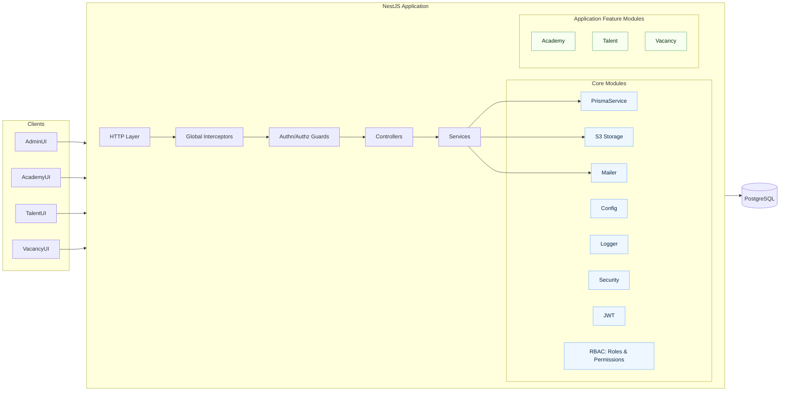
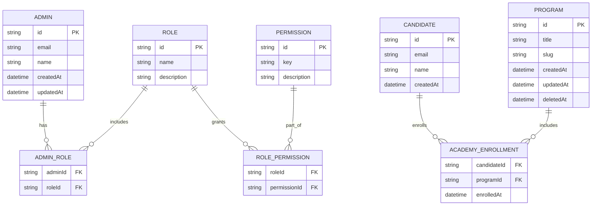

## Platform Architecture (Core + Academy + Talent + Vacancy)

This document describes a high-level architecture for a multi-app platform sharing a single database with multiple database schemas. Phase 1 focuses on Core and Academy; Talent and Vacancy will be added later.

### Goals

- Single repository with a shared Core serving multiple domain apps
- Single database for operational simplicity, with isolation via separate DB schemas: `core`, `academy`, `talent`, `vacancy`
- Clear ownership and boundaries; cross-app reuse through the Core
- Consistent auth, logging, and operational concerns across all apps

### Recommended architecture

- Monorepo with a single NestJS runtime (modular), organized by feature modules
- One Prisma schema with per-model `@@schema("...")` to place tables in specific DB schemas
- Single migration history that can touch multiple schemas in one change
- Optional route scoping by app namespace: `/academy/*`, `/talent/*`, `/vacancy/*`
- Strong RBAC in Core, app-specific permissions for each app

Rationale
- Keeps complexity lower than microservices while supporting clean boundaries
- Supports cross-schema relations (e.g., `academy` referencing `core` user/candidate)
- Enables later extraction into separate services if needed

### High-level component diagram

### Database layout

- Single Postgres database with schemas: `core`, `academy`, `talent`, `vacancy`
- Shared entities go in `core` (e.g., users/admins/candidates, roles, permissions, audit)
- App-specific entities live in their app schema (e.g., `academy.Program`)
- Cross-schema foreign keys permitted; Prisma supports this via cross-model relations

### Module boundaries and ownership

- Core owns: authentication, authorization (RBAC), user/admin/candidate, logging, mail, file storage, security, shared utilities
- Academy owns: curriculum entities (programs, webinars/lessons), enrollments, completion tracking
- Talent, Vacancy to define their own entities later; re-use `core` entities (e.g., candidate)

### API namespace strategy

- Route prefixes per app:
  - `/core/*` for administrative core endpoints (optional; admins could also be top-level)
  - `/academy/*` for learning endpoints
  - `/talent/*` and `/vacancy/*` later

### Authorization strategy

- Permissions defined in `core` (e.g., `academy.programs.read`), assigned to roles
- Guards enforce app/module-level permissions; feature modules declare required permissions

### Observability and cross-cutting

- Structured logging with request context IDs
- Global error filters and response envelope
- Metrics/tracing can be added via interceptors/middleware

### Evolution path

- Start single runtime (modular monolith)
- If needed, split apps into independent services behind an API gateway; keep DB shared or migrate to separate DBs per service

